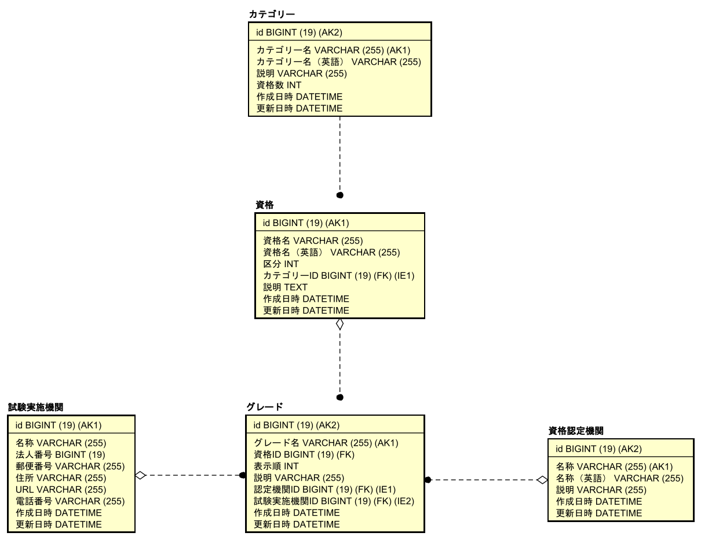

# README

## 概要
資格情報を管理するRuby on Railsサンプルアプリケーション

Docker上で起動し，ブラウザで [http://localhost:3000/](http://localhost:3000/) にアクセスする

<details>
<summary>ERD</summary>



</details>

<details>
<summary>画面の例</summary>

* 資格一覧画面


* 資格詳細画面


* 試験実施機関情報更新画面


</details>

<details>
<summary>APIの例</summary>

```
curl -H "Accept: application/json" -X GET "http://localhost:3000/qualifications/11"

{
	"id": 11,
	"name_ja": "旅行業務取扱管理者",
	"name_en": null,
	"classification": "国家資格",
	"category": "事務／法律",
	"grades": [
		{
			"id": 2,
			"grade_name": "総合",
			"display_order": 1,
			"description": "海外及び国内の旅行業務を取り扱うことができる",
			"examiner_name": "一般社団法人日本旅行業協会",
			"certificater_name": "観光庁長官"
		},
		{
			"id": 1,
			"grade_name": "国内",
			"display_order": 2,
			"description": "国内旅行業務のみを取り扱うことができる",
			"examiner_name": "一般社団法人全国旅行業協会",
			"certificater_name": "観光庁長官"
		},
		{
			"id": 3,
			"grade_name": "地域限定",
			"display_order": 3,
			"description": null,
			"examiner_name": "国土交通省観光庁",
			"certificater_name": "観光庁長官"
		}
	]
}
```
</details>

<details>
<summary>RSpec</summary>

```
root@5492364ca324:/app# bundle exec rspec

Category
  validation
    エラーなく更新できること
    既存のカテゴリー名と重複
      バリデーションエラーとなること
    カテゴリー名がブランク
      バリデーションエラーとなること

Certificater
  validation
    エラーなく更新できること
    不正な認定機関名
      既に存在する認定機関名がバリデーションエラーとなること
      behaves like invalid_name
        is expected to raise ActiveRecord::RecordInvalid with message matching /資格認定機関名を入力してください/
      behaves like invalid_name
        is expected to raise ActiveRecord::RecordInvalid with message matching /資格認定機関名を入力してください/
    不正な認定機関英語名
      behaves like invalid_name
        is expected to raise ActiveRecord::RecordInvalid with message matching /資格認定機関名（英語）は不正な値です/
      behaves like invalid_name
        is expected to raise ActiveRecord::RecordInvalid with message matching /資格認定機関名（英語）は不正な値です/

Examiner
  validation
    エラーなく更新できること
    不正な名称
      is expected to raise ActiveRecord::RecordInvalid with message matching /試験実施機関名を入力してください/
      is expected to raise ActiveRecord::RecordInvalid with message matching /試験実施機関名はすでに存在します/
    不正な郵便番号
      behaves like invalid_zipcode
        is expected to raise ActiveRecord::RecordInvalid with message matching /郵便番号は不正な値です/
      behaves like invalid_zipcode
        is expected to raise ActiveRecord::RecordInvalid with message matching /郵便番号は不正な値です/
      behaves like invalid_zipcode
        is expected to raise ActiveRecord::RecordInvalid with message matching /郵便番号は不正な値です/
      behaves like invalid_zipcode
        is expected to raise ActiveRecord::RecordInvalid with message matching /郵便番号は不正な値です/
    不正な電話番号
      behaves like invalid_tel
        is expected to raise ActiveRecord::RecordInvalid with message matching /電話番号は不正な値です/
      behaves like invalid_tel
        is expected to raise ActiveRecord::RecordInvalid with message matching /電話番号は不正な値です/
      behaves like invalid_tel
        is expected to raise ActiveRecord::RecordInvalid with message matching /電話番号は不正な値です/
    不正な法人番号
      behaves like invalid_corporate_number
        is expected to raise ActiveRecord::RecordInvalid with message matching /法人番号は整数で入力してください/
      behaves like invalid_corporate_number
        is expected to raise ActiveRecord::RecordInvalid with message matching /法人番号は数値で入力してください/
    不正なURL
      behaves like invalid_url
        is expected to raise ActiveRecord::RecordInvalid with message matching /URLは不正な値です/
      behaves like invalid_url
        is expected to raise ActiveRecord::RecordInvalid with message matching /URLは不正な値です/

Grade
  validation
    エラーなく更新できること
    同一のグレードが存在する
      既存グレードと同一の資格
        is expected to raise ActiveRecord::RecordInvalid with message matching /グレード名はすでに存在します/
      既存グレードと異なる資格
        is expected not to raise Exception

Qualification
  validation
    エラーなく更新できること
    不正な区分
      behaves like invalid_classification
        is expected to raise ActiveRecord::RecordInvalid with message matching /区分は一覧にありません/
      behaves like invalid_classification
        is expected to raise ActiveRecord::RecordInvalid with message matching /区分は一覧にありません/
      behaves like invalid_classification
        is expected to raise ActiveRecord::RecordInvalid with message matching /区分は一覧にありません/
    不正な名称
      behaves like invalid_name_ja
        is expected to raise ActiveRecord::RecordInvalid with message matching /資格名を入力してください/
      behaves like invalid_name_ja
        is expected to raise ActiveRecord::RecordInvalid with message matching /資格名を入力してください/
  counter_cache
    資格情報を作成した場合に当該カテゴリーのqualifications_countがインクリメントされること
    資格情報を削除した場合に当該カテゴリーのqualifications_countがデクリメントされること

Qualifications
  GET qualifications
    is expected to include {:name_ja => "試験0", :classification => "国家資格", :category => "技術bf952c96-6a80-404c-8380-2c5ad8611047"}
  POST qualifications
    is expected to respond with status code :found (302)
    不正なパラメータ
      is expected to include "資格名を入力してください"
  PATCH qualifications
    is expected to eq "新検定試験"
    不正なパラメータ
      is expected to include "区分は一覧にありません"
  DELETE qualifications
    is expected to respond with status code :found (302)
    削除対象が存在しない
      is expected to respond with a not_found status code (404)

Examiners
  GET examiners
    資格認定機関一覧が表示されていること
    新規登録ボタンで登録画面へ遷移すること
    編集ボタンで編集画面へ遷移すること
    削除ボタンで試験実施機関情報が削除されること
  POST examiners
    参照ボタンで詳細画面へ遷移すること
    正常に登録できること
    既に同じ名称が登録済
      登録できないこと
  GET examiners/:id/edit
    既存データが正しく入力欄にセットされていること
  PATCH examiners/:id
    正しく更新できること
    更新する値が不正
      エラーメッセージが表示され，更新できないこと

Finished in 31.92 seconds (files took 9.37 seconds to load)
51 examples, 0 failures
```
</details>

## 環境
* Ruby: 3.3
* Rails: 7.1.3.2
* MySQL: 8.0

## 更新履歴
* 2023.12.30 新規作成
* 2024.02.26 ライブラリ更新
